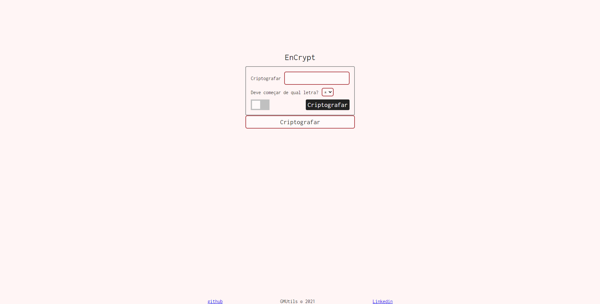
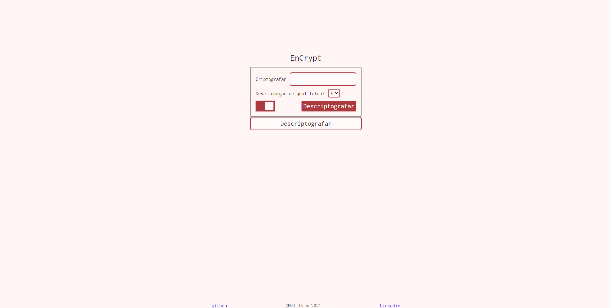
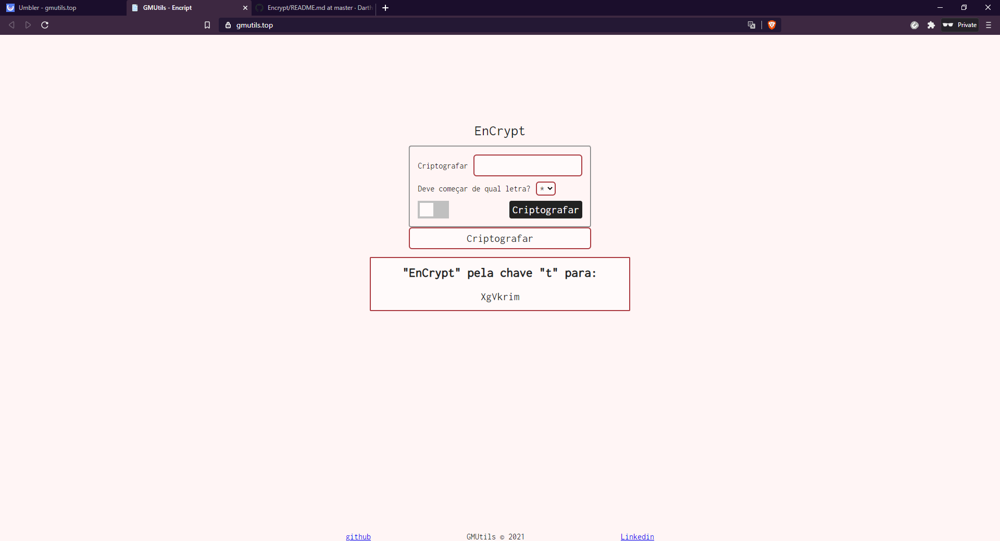
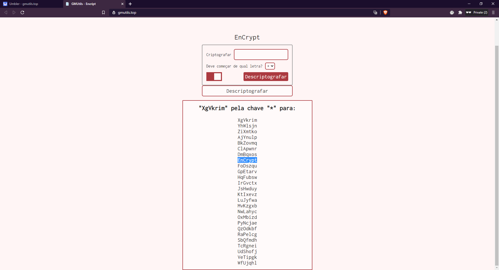

<h1 align="center">Encrypt</h1>

A simple Cesar cipher implementation algorithm using <a href="https://brython.info/" target="blank">Brython</a>, a Python 3 implementation for client-side web programming to script and logic.

 

<h3>Images</h3>
<h5>Encrypt</h5>

<h5>Decrypt</h5>

 

<h3>Using</h3>
<h5>Encrypting</h5>

Enter the word you want to encrypt and select the letter that will be equivalent to 'A'. Or let the algorithm select one to you.

<h5>Decrypting</h5>

To decrypt, do the same. Enter with encrypted word and select the letter... or let the algorithm show you all the possibilites

